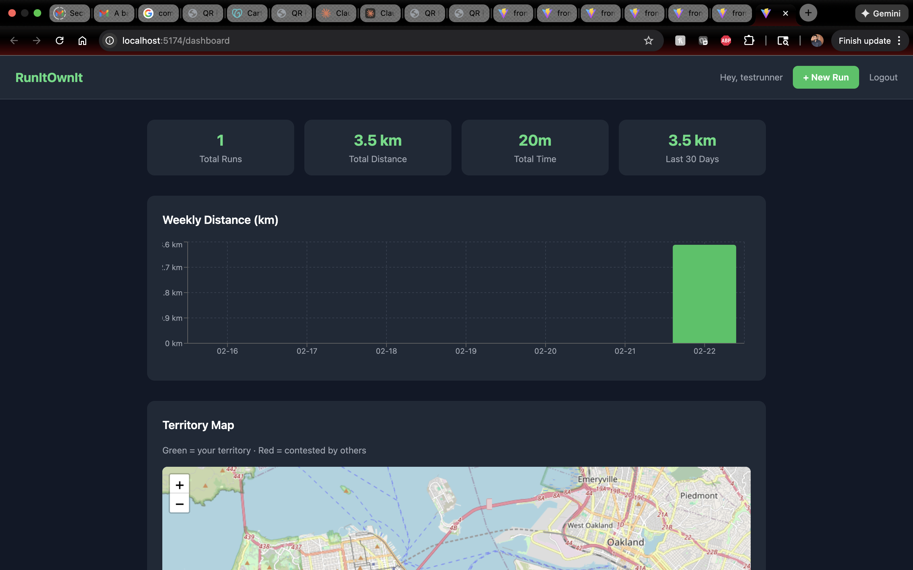
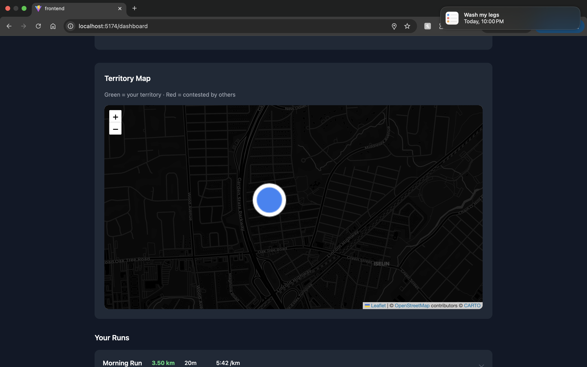

# RunItOwnIt

A Strava-style running tracker with a **GTA San Andreas-inspired territory ownership system** — log runs with GPS, claim grid cells on the map, and compete with other runners to dominate your neighborhood.

---

## Features

### Core Tracking
- Log runs with title, date, distance, duration, calories, and notes
- Live GPS recording via browser geolocation (`watchPosition`)
- Interactive route map with start/end markers (Leaflet + OpenStreetMap)
- Per-run pace calculation
- Weekly distance bar chart (Recharts)
- Stats summary: total runs, total distance, total time, last 30 days

### Territory System
- The map is divided into ~1km × 1km grid cells (`floor(lat × 100)`, `floor(lng × 100)`)
- Every GPS waypoint in a run contributes to your score in that cell
- The user with the most waypoints in a cell **owns** it
- Territory map shows:
  - 🟢 **Green** — cells you own
  - 🔴 **Red** — cells owned by someone else
  - Tooltip: owner name, their score, your score
- Waze-style dark map (CartoDB Dark Matter) that flies to your GPS location on load

### Auth
- JWT stateless authentication
- Register / Login
- Protected routes

---

## Tech Stack

| Layer | Stack |
|-------|-------|
| Backend | Spring Boot 2.7, Java 13, Spring Security, Hibernate/JPA |
| Database | MySQL 8 |
| Auth | JWT (jjwt 0.12.x), BCrypt |
| Frontend | React 18, TypeScript, Vite |
| Styling | Tailwind CSS v3 |
| Maps | Leaflet, react-leaflet, CartoDB Dark Matter tiles |
| Charts | Recharts |

---

## Project Structure

```
RunItOwnIt/
├── src/main/java/org/example/
│   ├── config/          # SecurityConfig, JwtFilter, JwtUtil, AppConfig
│   ├── controller/      # AuthController, RunController, StatsController, TerritoryController
│   ├── dto/             # RunRequest, RunResponse, StatsResponse, TerritoryResponse
│   ├── model/           # User, Run, RoutePoint, TerritoryScore
│   ├── repository/      # JPA repositories
│   └── service/         # AuthService, RunService, StatsService, TerritoryService
├── src/main/resources/
│   └── application.properties
└── frontend/
    └── src/
        ├── api/         # Axios client with JWT interceptor
        ├── context/     # AuthContext (localStorage JWT)
        ├── pages/       # Login, Register, Dashboard, NewRun, RunDetail
        └── components/  # RunCard, StatsChart, RouteMap, TerritoryMap
```

---

## Getting Started

### Prerequisites
- Java 13+
- Maven
- MySQL 8
- Node.js 18+

### 1. Database

```sql
CREATE DATABASE runitownit;
```

### 2. Backend

Edit `src/main/resources/application.properties`:
```properties
spring.datasource.url=jdbc:mysql://localhost:3306/runitownit
spring.datasource.username=root
spring.datasource.password=your_password
```

Run:
```bash
mvn spring-boot:run
# Starts on http://localhost:8080
# Hibernate auto-creates all tables on first run
```

### 3. Frontend

```bash
cd frontend
npm install
npm run dev
# Starts on http://localhost:5173
```

---

## API Reference

### Auth
| Method | Endpoint | Body |
|--------|----------|------|
| POST | `/api/auth/register` | `{ username, email, password }` |
| POST | `/api/auth/login` | `{ username, password }` |

### Runs *(JWT required)*
| Method | Endpoint | Description |
|--------|----------|-------------|
| GET | `/api/runs` | Paginated run list |
| POST | `/api/runs` | Create run (with optional `routePoints[]`) |
| GET | `/api/runs/{id}` | Single run with route |
| DELETE | `/api/runs/{id}` | Delete run |

### Stats *(JWT required)*
| Method | Endpoint | Description |
|--------|----------|-------------|
| GET | `/api/stats/summary` | Total runs, km, time, last 30 days |
| GET | `/api/stats/weekly` | Last 8 weeks of distance data |

### Territories *(JWT required)*
| Method | Endpoint | Description |
|--------|----------|-------------|
| GET | `/api/territories?minLat=&maxLat=&minLng=&maxLng=` | Territory cells in map bounds |

---

## How Territory Works

```
POST /api/runs  (with routePoints)
  └─> RunService saves Run + RoutePoints
  └─> TerritoryService.processRun()
        └─> Groups points by floor(lat×100), floor(lng×100)
        └─> Upserts TerritoryScore per (cell, user)
        └─> waypointCount accumulates across all runs

Dashboard loads → TerritoryMap fetches /api/territories
  └─> Top scorer per cell = owner
  └─> Green rectangle if ownedByMe, red if not
```

A cell is roughly **1.1km × 0.9km**. Run through an area more than anyone else and it turns green. Stop running there and a rival can take it back.

---

## Screenshots

### Dashboard — Stats, Weekly Chart & Territory Map


### Territory Map — Waze-style Dark Theme with GPS Location


---

## License

MIT
